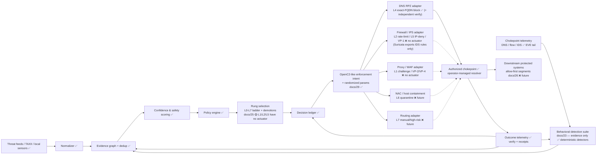

# Attack-Path Interdiction Platform (APIP)

> **APIP 0.1.0 is a public-beta *product*** — a deterministic, AI-free
> defensive control plane focused on safe **exact-FQDN DNS RPZ**
> shadow/canary enforcement with a durable ledger and a real operator CLI.
> **Start with [`PRODUCT.md`](PRODUCT.md)**.
>
> This repository also contains the broader APIP **specification** (`docs/`
> and `FULL_SPEC.md`) and an independent deterministic **reference oracle**
> (`reference/`). Features described in the specification are **not
> necessarily implemented in the beta** — see
> [`IMPLEMENTATION_STATUS.md`](IMPLEMENTATION_STATUS.md) for the exact
> `SPECIFIED / REFERENCE IMPLEMENTED / PRODUCT IMPLEMENTED / BETA SUPPORTED /
> FUTURE` status of every component. Do not assume a spec'd feature ships.

---

**Working specification and safe reference scaffold — v2.1 design, researched through 2026-09-01**

APIP is a defensive network-control platform intended for deployment at a network chokepoint that an operator owns or is explicitly authorized to control. It ingests cyber-threat intelligence and local telemetry, normalizes and corroborates evidence, computes bounded defensive decisions, compiles those decisions into vendor-neutral enforcement intents, and publishes short-lived controls to authorized DNS, firewall/IPS, proxy/WAF, NAC, or routing actuators.

The core value proposition is **one strategically placed deployment protecting many downstream systems without endpoint agents**.

**v2.1 upgrade (docs 23–30):** the design now covers the attack surface created by AI-assisted offensive tooling with six additional deterministic layers — behavioral detection of hostile *classes* of behavior, encryption/bypass resistance, a layered interdiction ladder that removes the shared-infrastructure safe harbor, allow-first (deny-by-default) egress for critical fixed-function segments, virtual patching for unpatched CVE windows, seeded randomization of defensive parameters (moving-target defense) that stays fully replayable, and a requester attribution/fingerprinting engine for campaign correlation. **The platform involves no AI components anywhere in its operation** — AI appears only in the threat model (`docs/28`), and attribution output can never authorize enforcement (`docs/30`).

## Operator and maintainer

This product is maintained for and attributed to **B-A-M-N**. Where any
documentation, log, or toolchain refers to the local OS account or system user
(`bamn`), that is purely the Linux account the tooling runs under — it is not
the operator/maintainer identity. The operator-facing surfaces (CLI, API,
audit trail) name the acting operator explicitly and ratably; attribution to
**B-A-M-N** is the human identity this product is accountable to.

## Scope boundary

APIP is not a hack-back system. It does not compromise, disrupt, scan, or manipulate third-party systems. It never assumes that an IP address or domain believed to be malicious is owned by an attacker; compromised third-party infrastructure is common. Enforcement is limited to traffic traversing infrastructure that the deploying organization is authorized to control.

The reference implementation in `reference/` is deliberately **offline and dry-run** for evaluation and enforcement compilation: it evaluates sample indicators and emits candidate RPZ and Suricata artifacts to files. It does not modify host firewall state, DNS servers, BGP sessions, cloud accounts, or third-party systems, and it never makes an outbound network connection.

The one exception is the attribution lab (`lab/` and `apip.cli capture serve`): an **optional loopback-only HTTP observation socket** (`127.0.0.1`/`::1` bind enforced) harvests behavioral fingerprints from local synthetic HTTP — an inbound test channel, not outbound network and not an actuator.

## Try the lab

```bash
cd lab && ./run.sh
```

The **Attribution Lab** (`lab/`, see its README) demonstrates the `docs/30` requester attribution engine end-to-end on loopback-only traffic: rotating attacker infrastructure collapsing into one behavioral fingerprint, distinct toolchains staying separate, one campaign correlating across different vendor log formats — and proof that attribution can never change a single enforcement decision. It opens `lab/output/attribution_report.html`, the analyst correlation view.

## Package map

- `FULL_SPEC.md` — consolidated product/system specification.
- `docs/01_PRODUCT_REQUIREMENTS.md` — functional and non-functional requirements.
- `docs/02_SYSTEM_ARCHITECTURE.md` — control plane, evidence plane, decision plane, enforcement plane.
- `docs/03_THREAT_MODEL.md` — threats to the platform and guardrails against false-positive outages.
- `docs/04_EVIDENCE_CONFIDENCE_POLICY.md` — scoring, confidence, blast-radius controls, action thresholds.
- `docs/05_DATA_AND_INTERFACES.md` — canonical objects, APIs, STIX/TAXII/OpenC2/CACAO/OCSF alignment.
- `docs/06_ENFORCEMENT_ADAPTERS.md` — DNS RPZ, firewall/IPS, proxy/WAF, routing adapter contracts.
- `docs/07_DEPLOYMENT_PROFILES.md` — local lab, utility/enterprise, managed resolver, ISP/provider.
- `docs/08_ENERGY_OT_ALIGNMENT.md` — energy-sector and OT-specific deployment constraints.
- `docs/09_SECURITY_PRIVACY_GOVERNANCE.md` — platform hardening, auditability, privacy, authorization.
- `docs/10_TESTING_VALIDATION.md` — unit, replay, integration, fault injection, performance, safety tests.
- `docs/11_OPERATIONS_RUNBOOK.md` — operating modes, promotion, rollback, incidents, feed failures.
- `docs/12_IMPLEMENTATION_BACKLOG.md` — concrete engineering work packages and repository layout.
- `docs/13_RESEARCH_SOURCES.md` — authoritative sources and architecture implications.
- `docs/14_ACCEPTANCE_CRITERIA.md` — release gates for prototype, pilot, and provider-grade operation.
- `docs/15_DESIGN_DECISIONS.md` — important architectural choices and rejected alternatives.
- `docs/16_ADVANCED_ANALYTICS.md` — passive correlation, infrastructure-sharing analysis, evidence decay, optional ML boundaries.
- `docs/17_PROVIDER_SCALE_AND_SLOS.md` — multi-edge architecture, signed bundles, tenant isolation, rollout/SLO model.
- `docs/18_PILOT_AND_DEMONSTRATION_PLAN.md` — offline → shadow → canary → constrained production validation.
- `docs/19_CONTROLS_AND_STANDARDS_MAPPING.md` — NIST/CISA/DOE/NERC/OASIS engineering crosswalk.
- `docs/20_SAFETY_CASE_AND_FAILURE_ANALYSIS.md` — hazards, mitigations, fault injection, abuse resistance.
- `docs/21_REFERENCE_DEPLOYMENT_BLUEPRINT.md` — concrete production component and adapter blueprint.
- `docs/22_OPERATOR_UI_AND_WORKFLOWS.md` — operator console, roles, explain/revoke/replay workflows.
- `lab/` — runnable demonstration lab (loopback-only) for the docs/30 attribution engine and its hard boundary.
- `docs/23_BEHAVIORAL_DETECTION_SUITE.md` — deterministic detection families (beaconing, DGA, DNS tunneling, fast-flux, volume, novelty, TLS mismatch), corroboration lattice, anti-gaming.
- `docs/24_ENCRYPTION_AND_BYPASS_RESISTANCE.md` — DoH/DoT known-hosts containment, coverage accounting, compensating posture.
- `docs/25_LAYERED_INTERDICTION_AND_SHARED_INFRASTRUCTURE.md` — L0–L7 response ladder; context-acting rungs safe on shared infrastructure.
- `docs/26_ALLOW_FIRST_MODE_FOR_CRITICAL_SEGMENTS.md` — deny-by-default egress for fixed-function segments; onboarding lifecycle.
- `docs/27_VIRTUAL_PATCHING_AND_EXPLOIT_PREVENTION.md` — VP-1–VP-4 virtual patch classes; exposure reduction; patch-tracking expiry.
- `docs/28_AI_ERA_ATTACK_POSTURE.md` — no-AI design invariant; deterministic counters to AI-era attack properties; automation abuse resistance.
- `docs/29_DETERMINISTIC_RANDOMIZATION.md` — seeded randomization of defensive parameters within policy bounds; replay-preserving moving-target defense.
- `docs/30_REQUESTER_ATTRIBUTION_AND_FINGERPRINTING.md` — deterministic challenge-based requester fingerprinting for campaign correlation; never an enforcement input.
- `api/openapi.future.yaml` — forward-design control-plane contract (NOT implemented; the contract the beta product actually serves is `api/openapi.beta.json`, generated from the FastAPI app).
- `sources.json` — machine-readable research source inventory.
- `schemas/` — JSON schemas for indicators, decisions, and receipts.
- `examples/` — safe sample configuration and synthetic indicators using reserved/test namespaces.
- `reference/` — dependency-free Python 3.11+ dry-run reference scaffold.

## Design in one diagram

**Implementation state is marked on every node** (audit #39 classification
standard: a capability counts as implemented only with the full
observation → decision → actuator → independent-verification → rollback
loop): ✅ beta-supported, 🟡 partially real, ❌ future design (no actuator).
The beta's genuinely enforcing path is the DNS RPZ adapter.



Dashed edges are design intent with **no actuator today** — a decision that
selects one of those rungs reports `decision valid / materialization
unavailable` (never a proposal inviting approval).

## The v2 layer stack

| Layer | Doc | Counters |
|---|---|---|
| Indicator interdiction (v1 core) | docs/04–06 | known malicious infrastructure |
| Behavioral detection | docs/23 | novel/polymorphic infrastructure, beaconing, tunneling, exfil |
| Bypass resistance | docs/24 | DoH/DoT chokepoint evasion, coverage gaps |
| Layered interdiction ladder | docs/25 | C2 on shared cloud/CDN (the v1 safe harbor), anonymizers |
| Allow-first segments | docs/26 | zero-day C2 egress from fixed-function OT/DMZ segments |
| Virtual patching | docs/27 | known-CVE exploitation while patches lag |
| Deterministic randomization | docs/29 | adaptive probing / filter-shaping by defensive-aware tooling |

All layers feed one deterministic decision pipeline; all actions inherit the v1 safety apparatus (two scores, TTLs, staging, budgets, receipts, rollback).

## Operating modes

1. **OFF** — ingestion may continue; no proposed or emitted actions.
2. **OBSERVE** — correlate telemetry and intelligence; record hypothetical outcomes only.
3. **SHADOW** — compile exact candidate controls and measure matches, but do not enforce them.
4. **ENFORCE** — publish only policy-approved, scoped, expiring controls.
5. **EMERGENCY** — operator-invoked profile with tighter thresholds and explicit approval requirements; never automatically entered.

Promotion must proceed through OBSERVE → SHADOW → ENFORCE. No feed may directly command an actuator.

## Quick start for the safe scaffold

```bash
cd reference
./verify.sh          # full suite: 180+ tests, no-AI conformance, schema conformance
```

Or run pieces individually (`PYTHONPATH=src` is required because the
scaffold is a src-layout package with zero installed dependencies):

```bash
cd reference
PYTHONPATH=src python -m unittest discover -s tests -v
PYTHONPATH=src python -m apip.cli evaluate ../examples/indicators.json \
  --policy ../examples/policy.toml \
  --out ../examples/generated
```

The command writes:

- `decisions.json`
- `rpz.zone`
- `suricata.rules`
- `receipts.json`
- `attribution_report.json` / `.html`

All example indicators use `.invalid` domains or TEST-NET IP space.

One budget knob is enforced by the engine (overflow demotes/reverts with
named reason codes — never silently exceeds):

- **Blast radius** (`max_new_auto_actions_per_batch`, docs/04 §8): one batch
  may propose at most that many AUTO_ENFORCE/SHADOW actions.

The L1 challenge-fraction knobs (`max_challenged_transaction_fraction_per_hour`,
`[measurement].interactive_transactions_per_hour`) are **rejected at policy
load**: no proxy-challenge actuator exists to pace, so carrying them would be
inert security configuration (audit #25 implement-or-reject rule). They may
return when the L1 actuator ships.

## Standards and guidance anchors

The architecture deliberately aligns to the following public standards/guidance:

- NIST Cybersecurity Framework 2.0 and NIST SP 800-61 Rev. 3.
- CISA Cross-Sector Cybersecurity Performance Goals and energy-sector guidance.
- OASIS STIX 2.1 and TAXII 2.1 for threat-intelligence representation/exchange.
- OASIS OpenC2 for vendor-neutral cyber-defense commands.
- OASIS CACAO 2.0 for structured playbooks.
- OCSF for normalized security telemetry.
- DNS Response Policy Zones (RPZ) for resolver-layer suppression.
- IETF RFC 8955/8956 for BGP Flow Specification, subject to strict safety controls.
- NERC CIP considerations for applicable Bulk Electric System operators.

See `docs/13_RESEARCH_SOURCES.md` for source URLs and the design consequence derived from each source.
