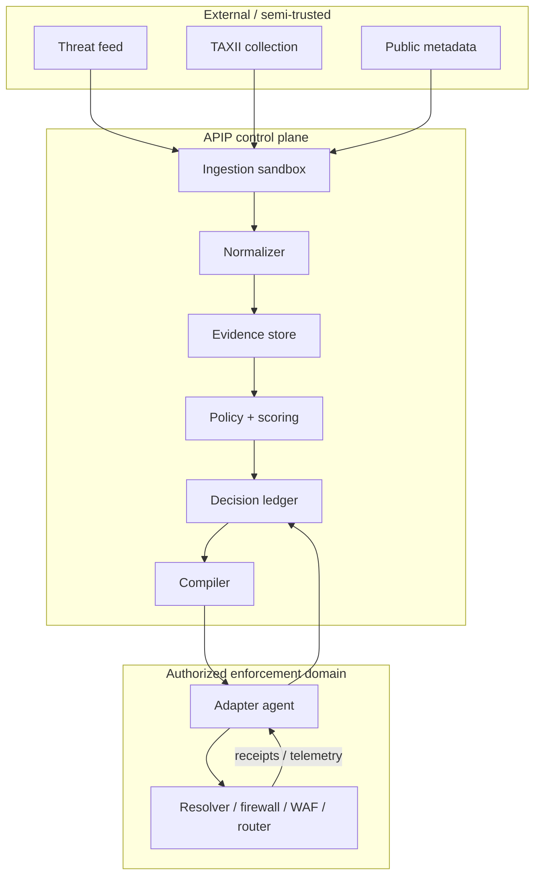

# 02 — System Architecture

> **v2 note:** the behavioral detection suite (`docs/23`), the interdiction ladder (`docs/25`), allow-first segments (`docs/26`), virtual patching (`docs/27`), and seeded randomization (`docs/29`) extend this architecture without adding a new trust boundary: behavioral detections and denial telemetry enter as evidence at the ingestion boundary; ladder selection and randomization are stages inside the decision plane; segments and inventory are governed policy objects. The platform involves no AI components anywhere (`docs/28`).

## Architectural planes

APIP is divided into five logical planes.

### 1. Intelligence plane
Responsible for collection, source authentication, parsing, normalization, deduplication, data marking, and provenance.

### 2. Evidence plane
Maintains the current evidence state for indicators and campaigns. It computes features such as independent-source count, freshness, conflicting evidence, shared-infrastructure risk, and local sightings.

### 3. Decision plane
Runs deterministic scoring and policy evaluation. It is the only plane permitted to create an enforcement decision.

### 4. Enforcement plane
Compiles decisions into actuator-specific artifacts and applies/validates them. It has no authority to invent decisions.

### 5. Audit/operations plane
Records evidence snapshots, policy versions, approvals, actions, receipts, telemetry, and revocations. Provides replay and explainability.

## Trust boundaries



Key rule: external sources terminate at the ingestion boundary. They cannot carry executable adapter instructions.

## Recommended initial implementation

Start as a modular monolith:

```text
apip/
  ingest/
  normalize/
  evidence/
  behavioral/        # v2: BD-1..BD-7 deterministic feature extractors (docs/23)
  scoring/
  policy/
  ladder/            # v2: rung selection + demotions (docs/25)
  randomize/         # v2: seeded parameter draws within bounds (docs/29)
  segments/          # v2: allow-first lifecycle + governed allowlists (docs/26)
  vpatch/            # v2: virtual patch compilation + patch tracking (docs/27)
  ledger/
  compile/
  adapters/
  api/
  telemetry/
```

Reasons:

- simpler correctness and transaction boundaries;
- easier deterministic replay;
- fewer distributed failure modes;
- easier single-operator development;
- can later separate ingestion/telemetry at provider scale.

## Authoritative state

PostgreSQL should be the authoritative metadata and decision store. Raw imported bundles should be retained as content-addressed blobs. Current enforcement state is derived from the ledger and adapter receipts, not inferred solely from “what policy says should exist.”

## Event model

Recommended event classes:

- `FeedFetched`
- `FeedParseFailed`
- `IndicatorCreated`
- `IndicatorUpdated`
- `EvidenceAdded`
- `EvidenceExpired`
- `BehavioralCandidate` (v2, `docs/23`)
- `BehavioralClusterFormed` (v2)
- `DecisionEvaluated`
- `DecisionApproved`
- `RungSelected` / `RungDemoted` (v2, `docs/25`)
- `RandomizedDrawRecorded` (v2, `docs/29`)
- `ActionPrepared`
- `ActionApplied`
- `ActionVerified`
- `ActionRevoked`
- `ActionExpired`
- `SegmentStageTransition` / `SegmentDenialObserved` (v2, `docs/26`)
- `VirtualPatchCreated` / `VirtualPatchRetired` (v2, `docs/27`)
- `AdapterDriftDetected`
- `SafetyBudgetExceeded`
- `AllowlistSuppressedAction`
- `CoverageBelowFloor` (v2, `docs/24`)

Events are immutable; current state is materialized.

## Policy bundle distribution

At multi-edge scale, the controller should distribute signed, versioned policy bundles to local adapter agents rather than issuing one RPC per rule. Each bundle includes:

- bundle ID/version;
- creation and expiry;
- target enforcement domain;
- ordered rule delta;
- policy version;
- decision IDs;
- signature;
- previous bundle hash.

Agents validate signature, scope, monotonic version, expiry, and size limits before activation.

## Canary rollout

Provider deployments SHOULD support rollout stages:

1. compile-only;
2. one test edge;
3. small canary edge group;
4. selected tenant cohort;
5. general rollout.

The rollout controller stops on error-rate, rule-match, latency, or customer-impact thresholds.

## Locality and failure isolation

Adapters should retain last-known-good state and local TTL information. If the central controller fails, the edge continues normal traffic processing without contacting the controller.

## Why not central inline proxying?

A central inline APIP proxy would create:

- a high-value failure point;
- large throughput/latency requirements;
- privacy exposure;
- operational coupling to every protected flow;
- difficult provider adoption.

The preferred design is a control plane that programs existing enforcement points.
